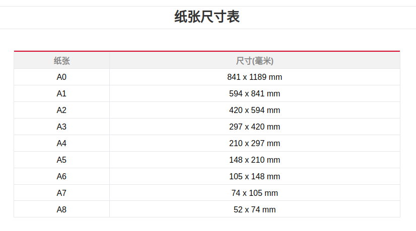

# doc-auto-dowod

auto create pdf dowod

## Package

1. reportlab

Used for generating PDF documents, such as creating a canvas or setting the page size.

2. pypdf

Used for reading, writing, and manipulating existing PDF files.

## Page size information

### Page size visualization

### Page size table

