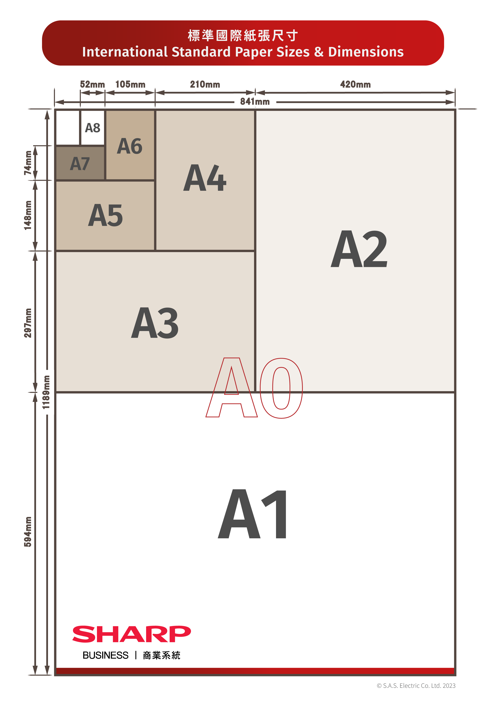

# doc-auto-dowod

auto create pdf dowod
## Structures
1. [merge_water_to_pdf.py](merge_water_to_pdf.py)
2. [run_create_authorization_letter.py](run_create_authorization_letter.py)
3. [run_create_editable_pdf.py](run_create_editable_pdf.py)
4. [run_fill_dowod_auto.py](run_fill_dowod_auto.py)

## Package

[Python处理PDF的第三方库对比
](https://dothinking.github.io/2021-01-02-Python%E5%A4%84%E7%90%86PDF%E7%9A%84%E7%AC%AC%E4%B8%89%E6%96%B9%E5%BA%93%E5%AF%B9%E6%AF%94/)

1. reportlab

Used for generating PDF documents, such as creating a canvas or setting the page size.

2. pypdf

Used for reading, writing, and manipulating existing PDF files.

3. convert docx to pdf
    - `libreoffice --convert-to pdf`: LibreOffice converts the `.docx` file to `.pdf`.
    - `--headless`: Ensures that LibreOffice runs without opening a graphical interface.
    - `Output Directory`: Specify the folder where the PDF will be saved.

Requires to install using `sudo apt install libreoffice`

## Page size information

[Reference link](https://www.sharp.com.hk/tc/offers-news/complete-guide-to-a-paper-sizes-quick-reference-handbook-for-design-print-dimensions)

### Page size visualization

### Page size table

